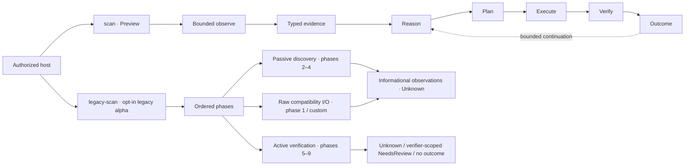

# Venom

[](https://github.com/ITherso/venom/actions/workflows/tests.yml)
[](https://itherso.github.io/venom/)
[](https://codecov.io/gh/ITherso/venom)
[](Cargo.toml)
[](LICENSE)

Venom is an experimental Rust security-testing project centered on a deterministic decision runtime that turns bounded web observations into typed evidence, hypotheses, risk-aware plans, and verifier-scoped outcomes.

> [!WARNING]
> **This remediated `0.10.0-alpha.1` source state is unreleased and not production-ready.** The historical `v0.9.0-alpha` binaries predate the bounded default runtime documented here and are not an installation path for this behavior. Build a reviewed, pinned commit from source and use it only on systems you own or are explicitly authorized to test. The default `scan` command is bounded, but it still makes network requests. The separately compiled `legacy-scan` has distinct bounded discovery and verification authorities, but phase one and custom extensions can still perform direct I/O outside `RuntimeBudget`, so its whole-run accounting is `Unmetered`. Preview and Experimental contracts may change.

**Why an action ran is not what it proved.** Venom keeps the evidence that motivates an action separate from the evidence that may change a hypothesis. An action can return `Success` after completing a knowledge-gathering objective without confirming its motivating hypothesis.



The two paths are separate. The deterministic runtime currently emits operational decisions and outcomes, not Surface-B findings. `decision-scan` is a deprecated command alias for the same deterministic path; it is not a second engine. Scanner SDK and plugin APIs are optional library surfaces and are not silently inserted into `scan`.

## Why Venom is different

Venom uses a deliberately narrow claim vocabulary:

| Term | Meaning in the deterministic runtime |
| --- | --- |
| **Observed** | Directly present in bounded, typed evidence |
| **Supported** | Deterministic reasoning currently supports a hypothesis |
| **Confirmed** | A verifier-authorized, case-correlated transition occurred |
| **Success** | The action objective succeeded; confirmation may still be forbidden |

This distinction carries practical consequences: an observation is not a vulnerability, same-origin is not authorization, a bounded sample is not a complete inventory, and a successful action is not automatically a reportable finding.

Execution decisions are deterministic and model-independent. Venom does not require an LLM to select, authorize, or verify actions.

## What works today

| Area | Current implementation |
| --- | --- |
| Decision state | Immutable typed evidence, subject-scoped knowledge, deterministic rules, hypothesis lifecycle, and stale-snapshot rejection |
| Planning | Deterministic utility/information-gain ranking with requirements, prerequisites, cost, risk, suppression, stable tie-breaking, and claim-policy-aware targets |
| Verification | Passive and active stages, case-correlated evidence, verifier-owned transitions, and KnowledgeOnly objectives that cannot confirm a hypothesis |
| Continuation | Multi-objective replanning, Experience-based suppression, bounded counters, and host-policy-checked adaptive authority |
| Execution | Exact-origin, redirect-disabled transport actions through one metered request broker; a tested zero-I/O `LocalKnowledge` library contract |
| Output | Concise text, `--explain`, and versioned machine-readable `decision-scan/v1` diagnostics |

The standard web profile currently has conservative, claim-specific behavior:

| Capability | What Venom can conclude |
| --- | --- |
| Nginx / Apache | A version-bearing server disclosure can directly confirm the matching technology hypothesis; a bare product token cannot |
| HTTP Basic / Bearer | A matching authentication challenge can confirm the corresponding boundary |
| Livewire | A direct Livewire response marker can confirm the matching hypothesis |
| PHP form controls | Collects bounded, names-only HTML control observations. The action is KnowledgeOnly: success does not confirm PHP |
| Laravel routes | Performs a bounded route-boundary check and preserves human-review semantics rather than confirming Laravel from a route response |
| Sanctum cookie surface | Records compatible cookie-name observations. The action is KnowledgeOnly and does not confirm Sanctum |

`LaravelInputAnalysis` remains unsupported in the standard executor catalog. The standard CLI profile uses transport-bound actions; `LocalKnowledge` is available to library hosts but has no built-in production action today.

## Try the deterministic runtime

Requirements: Rust 1.88 or newer, Git, and an authorized reachable HTTP(S) origin.

```bash
git clone https://github.com/ITherso/venom.git
cd venom
REVIEWED_COMMIT="REPLACE_WITH_THE_REVIEWED_FULL_COMMIT_SHA"
test "$REVIEWED_COMMIT" != "REPLACE_WITH_THE_REVIEWED_FULL_COMMIT_SHA"
git checkout --detach "$REVIEWED_COMMIT"
test "$(git rev-parse HEAD)" = "$REVIEWED_COMMIT"
cargo run -p venom-cli --locked -- scan https://authorized.example.test
```

`example.test` is a reserved placeholder. Replace it with an origin you own or are explicitly permitted to assess.

Inspect the decision chain or consume structured diagnostics:

```bash
cargo run -p venom-cli --locked -- scan https://authorized.example.test --explain
cargo run -p venom-cli --locked -- scan https://authorized.example.test --format json
```

`--explain` expands the text report. JSON already contains the full diagnostics and uses the documented, historically named [`decision-scan/v1`](docs/internals/decision-scan-json-v1.md) schema, so the two flags cannot be combined. The deprecated, discoverable `decision-scan` compatibility alias accepts the same options and produces identical stdout and stderr.

The Preview profile enforces fixed request, wall-time, response-byte, request-body, active-verification, same-action, and no-progress limits. Redirects are disabled and every built-in request competes for the same runtime budget.

### Legacy ordered scanner

The historical ordered runner is absent from default builds. It can be compiled explicitly and requires acknowledgement at invocation:

```bash
cargo run -p venom-cli --locked --features legacy-scanner -- legacy-scan \
  https://authorized.example.test --acknowledge-legacy-heuristics
```

`legacy-scan` runs the historical heuristic phase pipeline. Its crawler,
wordlist-based directory discovery, and parameter discovery share a passive,
exact-origin, redirect-disabled broker with finite depth, page, request,
request-timeout, wall-time, cumulative-body, and per-response-body limits.
Directory discovery remains separately disabled unless
`--legacy-directory-fuzz` is supplied. These phases commit typed discovery state
atomically and produce only informational observations: directory candidates
must differ from two stable randomized nonexistent-path controls in the same
parent namespace and path shape, while parameters must
pass a reproducible baseline/control/candidate/replay comparison.

Phases five through nine use a second exact-origin, redirect- and
retry-disabled authority accounted at the `Active` stage. `VerificationLimits`
bounds its requests, per-request timeout, shared wall time, cumulative delivered
body bytes, and retained bytes per response. SQL behavior and template
arithmetic differentials—and an SDK host's explicitly configured benign local-file
canary—can produce verifier-owned, knowledge-only `NeedsReview` outcomes. Exact
reflection remains an `Unknown` observation because no browser-execution
verifier exists. XXE is inert; SSRF is inert by default, and an SDK host's
explicit OOB delivery records only a nonce-bearing probe receipt. The current
legacy contract has no callback verifier and produces no SSRF outcome. No
cloud-metadata or sensitive-file probe is compiled as a default.

That scoped boundary does not make the historical runner a bounded decision
runtime. Phase one and custom `ScanPhase` extensions can retain direct I/O
outside `StandardWebDecisionRuntime` and both bounded authorities, so the
complete run remains `Unmetered`. CLI output deliberately withholds unverified
phase detail; raw compatibility records project as `Unknown`, while only the
allowlisted verifier bridge can project the `NeedsReview` outcomes above. See
[ADR 0016](docs/adr/0016-bound-legacy-discovery-authority.md) and
[ADR 0018](docs/adr/0018-bound-legacy-verification-authority.md).

See the [runtime map](docs/internals/runtime-map.md) for the exact module and command inventory.

## What Venom does not claim

- An observed Nginx or Apache version is not, by itself, a vulnerability.
- Named HTML controls do not confirm PHP, and control values are never copied into form-control evidence.
- Sanctum-compatible cookie names do not confirm Laravel Sanctum.
- A same-origin route is not authorization to request it; the host remains the authority boundary.
- Missing evidence in a bounded or truncated sample is not evidence of absence.
- Successful execution is not automatically confirmation, a finding, or a vulnerability claim.
- A repeated SQL timing differential, exact text reflection, or template-arithmetic result still requires claim-specific review; none is an exploit or vulnerability verdict.
- Delivering an OOB callback URL to the target is not evidence that the target made the callback. HTTP 200, 401, or 403 is only the probe response.
- JSON/GraphQL fingerprints and paired visibility differences remain observations or review hypotheses unless a dedicated verifier says otherwise.

## Runtime surfaces

| Surface | Status | Current boundary |
| --- | --- | --- |
| `venom scan` | Preview | Default bounded deterministic web decision runtime with text, explain, and JSON diagnostics |
| `venom decision-scan` | Deprecated alias | Compatibility name for the same deterministic command and engine; the wire schema remains `decision-scan/v1` |
| `venom legacy-scan` | Legacy alpha, opt-in | Historical mixed-authority pipeline: phases 2–4 share bounded passive discovery, phases 5–9 share separate bounded active verification, and phase-one/custom raw I/O keeps the whole run `Unmetered`; requires `legacy-scanner` and explicit acknowledgement |
| Scanner SDK / native plugins | Preview, opt-in | Source-level host extensions; plugins receive a host-owned bounded context and record observations, not findings. No stock detector plugins ship, and plugins are not merged into the default runtime |
| Run-report renderer | Preview, opt-in | Source-level `reporting` library API renders an existing typed `RunReport` under a hard output ceiling; the host must pre-redact projected fields, and the renderer has no repository CLI caller, I/O, persistence, finding/risk synthesis, redaction, or verdict authority |
| Lua execution | Experimental, opt-in | Implemented bounded, cooperative in-process Lua 5.4 registry/executor for explicit library hosts; no standard libraries, process isolation, plugin bridge, scanner phase, or repository CLI caller |
| Distributed coordination | Experimental, opt-in | Implemented deterministic, bounded in-process task/worker/result state machines for explicit library hosts; no transport, authentication, serialization, persistence, ambient clock, background work, or multi-node control plane |
| `venom api` | Unsupported, opt-in | Absent from default builds; the `api-adapter` feature reports that no listener is implemented |
| `venom proxy` | Experimental, opt-in | Absent from default builds; `proxy-adapter` exposes an explicit fixed-upstream TCP relay with no `CONNECT`, TLS termination, certificate generation, or HTTP inspection |

Lua and distributed coordination are implemented Experimental host-library
surfaces, but no repository runtime calls them. Dashboard, monitoring,
compliance, threat-intelligence, and related modules remain optional,
host-owned, compile-only, or experimental depending on the feature. None runs
in the default deterministic path or `legacy-scan`. The [runtime
map](docs/internals/runtime-map.md) is the source of truth.

The scanner default is exactly `core` plus `scanning`. Historical phases,
platform data models, bounded run-report renderers, native plugins, Lua, and distributed
workers require the independent `legacy-scanner`, `platform-models`,
`reporting`, `plugins`, `lua`, and `distributed` features. The CLI's unsupported
API hook and experimental relay require `api-adapter` and `proxy-adapter`.

## Quality and robustness

| Control | Current evidence | Important limit |
| --- | --- | --- |
| Tests | Unit, integration, doc, security, template, and architecture jobs in [CI](.github/workflows/tests.yml) | Passing CI is not production readiness |
| Rust compatibility | MSRV 1.88 plus stable, beta, and nightly | Pre-stable APIs may still change |
| Coverage | Pinned Tarpaulin's LLVM backend enforces the accepted [21,439/24,842 observed source-line baseline](docs/reports/coverage/6edc4d925739.md) plus the same exact ratio on coverable changed lines; `venom.coverage.v2` evidence binds a normalized line-state digest | Coverage is a scoped navigation signal, not proof of test adequacy; the advisory [Codecov](https://codecov.io/gh/ITherso/venom) upload is best-effort and tokenless availability is not enforced |
| Safe Rust / boundaries | Workspace crates forbid unsafe code; architecture checks enforce dependency and transport ownership | Static boundaries do not prove semantic correctness |
| Public API compatibility | Blocking SemVer comparison for `venom-core` | Scanner, CLI, API, and proxy are outside that baseline |
| Security scanning | RustSec, cargo-deny, Semgrep CE, Trivy, Dependabot, and scoped CodeQL | Automated scanners have false positives and false negatives |
| Fuzzing | PR seed replay and compile checks; bounded scheduled/manual campaigns for four product-semantic and five parser targets | Time-bounded fuzzing is not a safety proof |
| Mutation testing | Scoped, evidenced campaigns for selected policy, planner, runtime, and extraction contracts | No permanent mutation farm or project-wide score |
| Performance | Compile/binary metrics and Criterion microbaseline artifacts | Controlled endpoint-scale CPU/RAM/latency report is still missing |
| Independent audit | Not completed | External review remains a stable-release gate |

See [Fuzzing](docs/fuzzing.md), [Quality metrics](docs/quality-metrics.md), [Repository health](docs/repository-health.md), and [Project status](PROJECT_STATUS.md) for scope and caveats.

## Project status

The latest published tag, **v0.9.0-alpha**, is historical and predates this source contract; `main` targets the next Preview release. Build from a reviewed, pinned source commit until a remediated tag exists. Alpha means public contracts, output details, and integration boundaries may change. Lifecycle labels describe maturity, not completeness:

- [Feature lifecycle](FEATURES.md)
- [Stable-release gates and active blockers](PROJECT_STATUS.md)
- [Changelog](CHANGELOG.md)

The current source state has no independent security audit, stable scanner/plugin ABI, endpoint-scale performance report, supported API service, supported MITM proxy, or deployable distributed control plane.

## Repository layout

```text
crates/       Rust workspace crates: core, scanner, CLI, API adapter, proxy relay
docs/         Architecture, operating guides, ADRs, and contributor internals
fuzz/         cargo-fuzz harnesses and reviewed seed corpora
templates/    Scanner SDK and plugin starter templates
xtask/        Repository validation, docs, release, benchmark, and generator tasks
examples/     Small public-API examples compiled in CI
web/          Disconnected dashboard preview; not a scan-runtime component
profiles/     Experimental configuration samples; not wired to CLI scan commands
```

The root `Cargo.toml` is a virtual workspace manifest. Runtime ownership and feature participation are documented in [Architecture](docs/architecture.md) and the [runtime map](docs/internals/runtime-map.md).

## Scanner SDK and plugins

Both generated starters compile in CI, but their source-level contracts remain Preview. The plugin starter is an INFO-only trait-boundary fixture: Venom ships no stock detector plugins, and plugin observations still require host reasoning and verification before any finding projection.

```bash
cargo install cargo-generate
cargo xtask generate scanner my-scanner
cargo xtask generate plugin my-venom-plugin
```

See the [Scanner SDK guide](docs/sdk.md), [Plugin development](docs/plugin.md), and [plugin API policy](docs/plugin-api-policy.md). Pin a Venom release tag or commit before publishing a third-party integration.

## Documentation

- [Getting started](docs/GETTING_STARTED.md)
- [Distribution and installation](docs/DISTRIBUTION.md)
- [Architecture](docs/architecture.md)
- [Runtime map: what actually runs](docs/internals/runtime-map.md)
- [Lua execution](docs/lua.md)
- [Distributed coordination](docs/distributed.md)
- [Decision runner](docs/internals/decision-runner.md)
- [Web execution](docs/internals/web-execution.md)
- [Web verification](docs/internals/web-verification.md)
- [`decision-scan/v1` JSON](docs/internals/decision-scan-json-v1.md)
- [Fuzzing](docs/fuzzing.md)
- [Security policy](SECURITY.md)
- [Documentation site](https://itherso.github.io/venom/)
- [Rust API documentation](https://itherso.github.io/venom/rust/venom_scanner/)

## Roadmap

- Stabilize the deterministic runtime, Scanner SDK, and plugin contracts behind explicit compatibility baselines.
- Strengthen evidence lineage, replay/provenance contracts, and bounded application-structure semantics before adding broader domain behavior.
- Expand reviewed semantic corpora and scoped mutation coverage without turning either technique into a completeness claim.
- Publish controlled endpoint-scale CPU, memory, latency, and throughput evidence.
- Complete an independent security review and validate the contributor/SDK path with external adopters.
- Explore bounded framework/CMS profiles only after their evidence, authorization, and claim policies are explicit; no WordPress or full Laravel scanner ships today.

Roadmap items are intentions, not delivery guarantees. Deterministic execution remains the authority boundary; any future model-assisted explanation or correlation layer must not silently control execution.

## Contributing

Read [CONTRIBUTING.md](CONTRIBUTING.md) and the [Code of Conduct](CODE_OF_CONDUCT.md), or start with a scoped [`good first issue`](https://github.com/ITherso/venom/labels/good%20first%20issue). Keep dependencies pointed inward and run formatting, Clippy, and tests before opening a pull request. Report vulnerabilities privately according to [SECURITY.md](SECURITY.md).

## License

Venom is licensed under the [MIT License](LICENSE). Contributions are accepted under the same terms unless explicitly stated otherwise.
