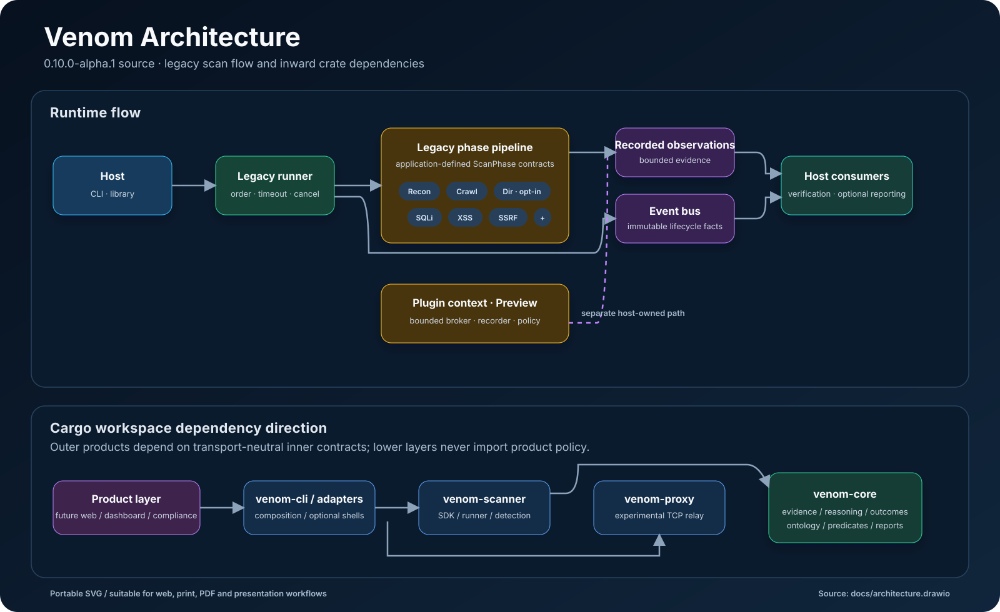
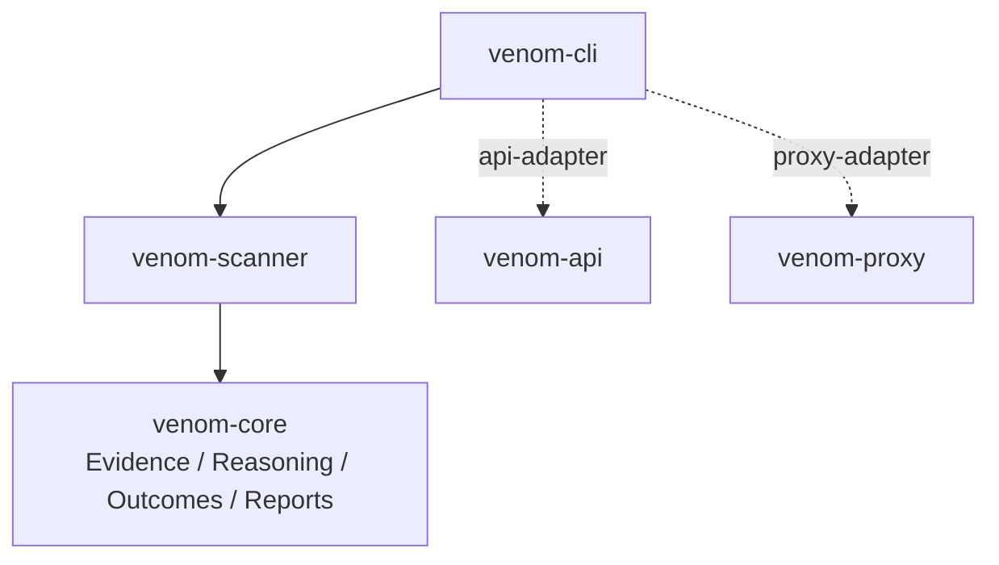
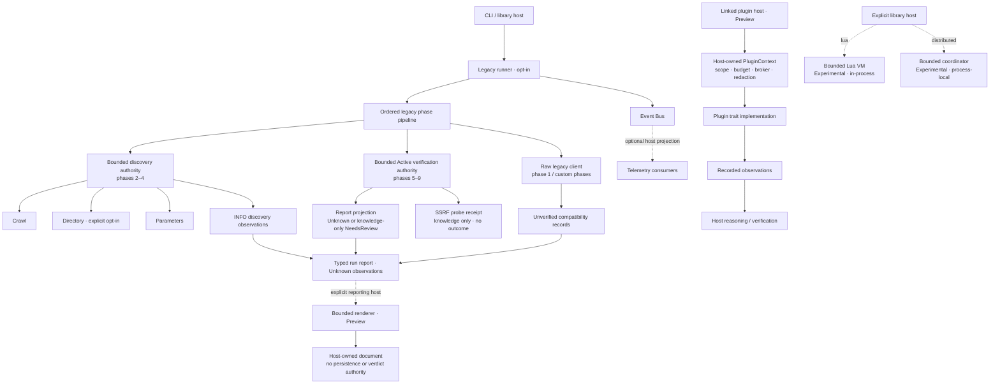
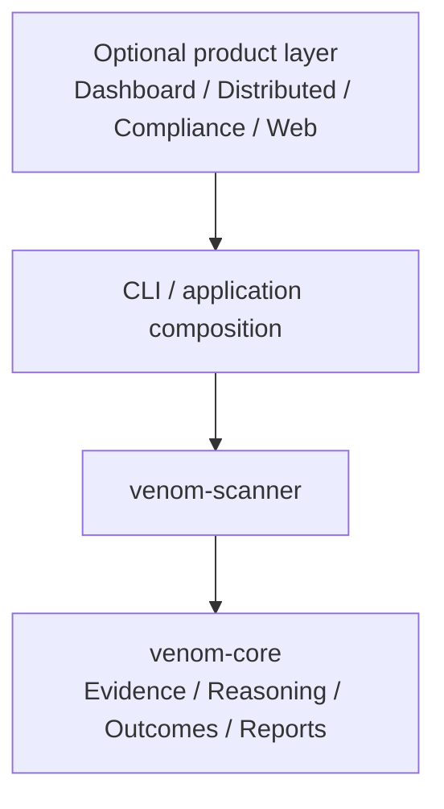
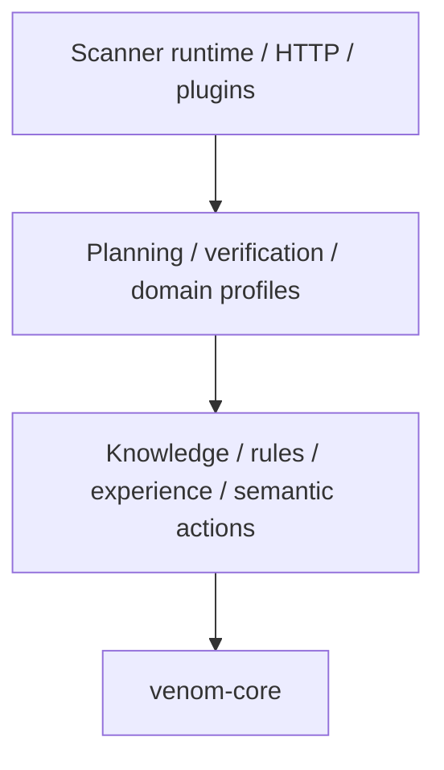

# Architecture

This document defines dependency direction and runtime ownership for the unreleased Venom `0.10.0-alpha.1` source line. It is a design contract, not a production-readiness claim.

The editable diagrams.net source is [architecture.drawio](architecture.drawio). A presentation- and print-friendly export is available as [architecture.svg](images/architecture.svg).



## Current workspace

| Crate | Responsibility | May depend on |
| --- | --- | --- |
| `venom-core` | Default transport-neutral evidence, reasoning, ontology, outcome, predicate, and run-report contracts; the pre-quarantine facade is feature-gated | External libraries only |
| `venom-scanner` | Phase/plugin traits, deterministic reasoning, runner, detection, opt-in bounded report rendering, and Experimental host-owned Lua/coordination execution | `venom-core` |
| `venom-proxy` | Experimental fixed-upstream TCP relay; no HTTP/TLS interception | External libraries only |
| `venom-api` | Library health router and its local unsupported-listener error | External libraries only |
| `venom-cli` | Composition root and command routing | `venom-scanner` by default; `venom-api` and `venom-proxy` only through explicit adapter features |

`xtask` is repository tooling rather than a runtime layer. It may orchestrate workspace commands but application crates must not depend on it.

The repository root is a virtual Cargo workspace and has no `src/` tree. Rust
source must live under a declared workspace package; otherwise it would be
excluded from build, test, documentation, release, and quality gates. The
architecture preflight rejects a virtual root containing `src/`. It also
rejects any top-level `.rs` file in the examples package that is not declared as
a Cargo target, so example source cannot silently fall outside compilation.



The pre-quarantine `Config`, shared `Error`, lifecycle-event, `ScanFinding`, raw
HTTP, vulnerability, and scan-result records remain in `venom-core` only behind
its non-default `legacy-contracts` feature for the pinned alpha compatibility
baseline. `venom-scanner` forwards that feature only for `legacy-scanner` and
`platform-models`; the default decision runtime and the `reporting` feature
cannot import those records. The scanner owns behavior such as `EventBus`,
`ScanRunner`, `ScanPhase`, and `Plugin`. `ScanFinding` is a legacy phase
compatibility contract; the Preview plugin and reporting contracts do not
accept it.
`venom-api` owns its small adapter error locally and has no workspace-crate
dependency.

No lower-level crate may depend on `venom-cli` or `venom-api`. A cycle between workspace crates is a release blocker.

## Runtime ownership



This diagram describes the legacy Surface-A orchestration boundary. Its
phase-two-to-four discovery and phase-five-to-nine verification envelopes do
not make whole-run accounting metered: phase one and host-defined custom phases
can retain raw direct-I/O authority. It also does
not imply that the deterministic Surface-B runtime projects verification
outcomes into findings, that a legacy `NeedsReview` outcome is a vulnerability
verdict, that the optional renderer persists a document, or that a dashboard
subscriber is composed by either CLI scan command.

The runner knows `ScanPhase`, not concrete phase implementations. The plugin
registry knows `Plugin`, not concrete plugin types. A linked host constructs the
execution request, the registry materializes the plugin context, and the host
retains authorization, transport, redaction, provenance, and verification
authority. Plugin observations do not automatically become
findings. An opt-in `PluginDecisionExecutor` can forward registry observations
through the deterministic runner when a host supplies the full execution
request; no stock CLI composes that bridge. Native plugin execution and the
ordered phase runner remain parallel paths, and neither CLI scan command loads
plugin crates dynamically.

## Scanner modules

```text
venom-scanner/src/
|-- phases/          ordered scan implementations
|-- legacy_discovery.rs  distinct bounded transport for ordered phases 2–4 and 5–9
|-- plugin.rs        Preview trait, host context, registry, and evidence boundary
|-- contracts.rs     scanner traits and core contract re-exports
|-- runner.rs        scheduling, timeouts, cancellation, aggregation
|-- event_bus.rs     legacy-scanner host event delivery (opt-in)
|-- reporting.rs     bounded typed RunReport renderer (opt-in)
|-- distributed.rs   bounded process-local coordinator and result store (opt-in)
|-- advanced_detection.rs  validated signal and technique records (opt-in)
|-- anomaly.rs       validated deviation records and text matching (opt-in)
|-- ml.rs            external-model record types only (opt-in)
`-- lua_engine.rs    bounded host-owned Lua registry and executor (opt-in)
```

## Target product-layer split

Dashboard, distributed orchestration, compliance, and web application concerns should move outward once their contracts stabilize.



This target supports separate open-source and commercial distributions without making `venom-core` or `venom-scanner` aware of product policy. No placeholder `venom-enterprise` crate should be created until ownership, licensing, and stable interfaces are defined.

## Boundary rules

1. The CLI or application crate is the composition root.
2. The runner owns scheduling, timeout, cancellation, events, and aggregation, not detection logic.
3. Legacy phases implement their documented observation/verification contracts;
   plugins record observations through host policy and never own finding or
   transport authority.
4. The event bus carries immutable lifecycle facts; subscribers do not control execution through hidden callbacks.
5. The opt-in distributed contract owns bounded/versioned process-local records,
   explicit logical time, and ordered state transitions. Callers own any wire
   encoding, authenticated transport, persistence, coordinator epoch, and
   background execution; the public types intentionally define no serialization
   protocol.
6. The opt-in Lua contract snapshots approved-root text source and exposes only
   a private scalar context/output environment in a fresh no-standard-library
   VM. Its memory, instruction, deadline, and cancellation controls are
   cooperative in-process limits, not process isolation.
7. The opt-in report renderer consumes an immutable typed `RunReport`, performs
   no I/O or redaction, and neither mutates scanner state nor creates findings
   or verdicts. Hosts must pre-redact projected target, authorized-origin,
   action-identifier, and outcome-summary fields.

## Reasoning and runtime boundary

The decision engine remains inside `venom-scanner` during alpha, but its module
direction is treated as an extraction boundary rather than an informal style
preference.



| Protected layer | Modules | May import |
| --- | --- | --- |
| Evidence preparation | `api_evidence` | `venom-core` plus bounded JSON/hash libraries; never network, runtime, planner, or knowledge state |
| Reasoning state | `experience`, `rules` | `venom-core`; `rules` may also use `knowledge` |
| Payload derivation contract | `payload_strategy` | Bounded collections, serialization, and hashing only; never knowledge, runtime state, clocks, randomness, or transport |
| Planning and verification | `planner`, `verification` | `knowledge`, `rules`, `payload_strategy`, `venom-core` |
| Semantic action, ingestion, and domain profiles | `web_actions`, `web_reasoning`, `api_reasoning`, `api_observation`, `web_planning`, `web_verification` | The lower rows above; never execution or HTTP modules |
| Execution and composition | `decision_runner`, `http_evidence`, `web_execution`, `web_runtime` | All inward contracts needed to perform and account for work |

Within the bounded standard runtime, `http_evidence/request_broker.rs` is the
sole owner of a raw HTTP client. Built-in bootstrap, planned, adaptive, retry,
and active-verification traffic must pass through its shared atomic accounting
authority. The architecture check rejects direct client or socket acquisition
from the surrounding decision/runtime modules. The standard runtime must call
the explicitly metered broker constructor; the architecture gate rejects a
switch to the named legacy unmetered constructor.

The ordered legacy runner is separate. Its phases two through four share a
context-owned passive discovery authority that accepts exact-origin requests,
disables redirects, applies one configurable request/time/body envelope, and
commits typed discovery deltas atomically. Phases five through nine share a
second context-owned authority with its own `VerificationLimits`; it admits
bodyless exact-origin requests, disables redirects and retries, and accounts
them at the `Active` stage under a separate request/time/body envelope. Neither
authority composes `StandardWebDecisionRuntime` or extends its `RuntimeBudget`.

The architecture gate prevents built-in phases two through nine from
reacquiring a raw client or dispatching outside the authority assigned to their
phase class. The raw legacy client remains available to phase one and
host-defined custom `ScanPhase` extensions, so the whole ordered run remains
`Unmetered`. Within the active slice, only the SQL-behavior,
template-arithmetic, and explicitly configured local-file-canary action IDs may
cross a verifier-owned bridge, and only as case-correlated, knowledge-only
`NeedsReview` outcomes. Exact reflection has no browser verifier; XXE dispatch
is disabled; and configured SSRF OOB delivery records a probe receipt without a
callback conclusion.

`web_actions` owns stable semantic action and route identities. Planning,
verification, and execution are sibling consumers; an executor's HTTP method or
client policy never defines what the verifier is allowed to reason about.

`venom-core::predicates` owns the canonical HTTP observations, web conclusions,
API conclusions, and atomic paired-visibility contract shared by producers and
reasoners. `api_reasoning` consumes those transport-neutral contracts to infer
JSON/GraphQL fingerprints and reviewable visibility boundaries. It performs no
requests, does not combine independent observations into a pair, and never
declares a vulnerability.

HTTP execution emits normalized protocol observations for API reasoning:
validated lowercase media-type essences, an explicit JSON-compatibility flag,
and bounded path segments. A host-paired comparison becomes an
`ApiVisibilityObservation` containing one pseudonymous evidence record and one
stable, evidence-backed `api.visibility.resource-scope` edge. The knowledge
base's `insert_evidence_with_relation` operation preflights and commits that
pair under one write lock, so an identity or linkage conflict cannot leave an
orphaned half of the bundle. This is storage consistency, not proof that a
producer's comparison is true.

`api_evidence` is the pure Evidence Engine boundary for paired JSON views. It
canonicalizes under explicit hard ceilings, retains only raw-value-free
signatures, and produces the transport-neutral comparison contract. The
`api_observation` ingress then validates the expected resource, commits the
evidence/relation pair, applies rules to the isolated comparison subject, and
returns an auditable receipt. It does not weaken the decision runner's rule that
executor evidence must match the outstanding case subject. Resource-scoped
review is a cursor-bounded relation projection, not an implicit cross-subject
planner input. Rejected relation shapes consume the page budget and a compiled
ceiling prevents unbounded projection work. Stored relation IDs, endpoints,
custom kinds, and provenance sets also have hard size ceilings; pagination
checks look-ahead on the borrowed index without cloning the next record.

Bayesian contribution aggregation remains an explicit rule-level choice.
`EvidenceCalibration::new` defaults to `Independent`, preserving the behavior
of existing profiles. Each standard API policy likelihood alone selects
`MaxContributions(1)`, limiting retry-driven posterior inflation for one
selector without changing other reasoning profiles.

A rule cycle evaluates every rule against one immutable subject snapshot and
preflights every matched hypothesis before committing the batch. Verifier-owned
`Confirmed` and `Rejected` states are preserved under that same write lock. A
late identity conflict therefore cannot commit only the earlier rule
conclusions or race a terminal verifier transition back to `Supported`.
Subject-local and ontology revisions provide a compare-and-swap boundary; a
stale cycle is re-evaluated under a fixed retry limit and then fails explicitly.
Verifier lifecycle transitions mutate only the latest stored state under the
knowledge lock, preserving concurrent belief and strength updates. Complete
verification reports carry the evaluated subject/ontology revisions; stale
reports are rejected, same-terminal replay is idempotent, and opposite terminal
transitions conflict instead of becoming last-writer-wins.

Planning prepares its session transition on a clone and swaps it only after
planner validation and command construction succeed. A final subject/ontology
revision check holds the knowledge read lock through that short swap, so a stale
plan cannot advance the session. Rule writes still precede planning and remain
append-only. A later planning failure therefore returns a typed reasoning
receipt with exact application write statuses and planner snapshot revisions
while leaving the replayable session unchanged.

Run the machine-enforced boundary locally:

```bash
cargo xtask architecture
```

The command rejects uncompiled source at the virtual workspace root and
undeclared top-level Rust sources in the examples package, validates workspace
dependencies and centrally inherited lint policy through locked Cargo metadata,
inspects protected production imports through the Rust AST, enforces
standard-runtime transport ownership, prevents migrated discovery and
verification phases from reacquiring direct I/O or crossing each other's
authority seam, freezes the remaining built-in legacy direct-I/O inventory,
verifies canonical `lib.rs` module and external-root wiring, and compiles
`venom-scanner` with no default features. For Lua and distributed coordination,
it also pins independent raw feature closures, private modules and exact root
reexports, public symbol/constant inventories, private ownership snapshots,
ordered/integer-only state, absence of ambient filesystem/network/process/time
authority, exact VM construction and text/private-environment loading, and
source fingerprints with adversarial mutations. See
[ADR 0004](adr/0004-reasoning-runtime-boundary.md) and
[ADR 0012](adr/0012-account-delivered-transport-bytes.md), which supersedes
[ADR 0009](adr/0009-host-owned-transport-accounting.md). Planner-selected,
raw-value-free execution strategy references are specified by
[ADR 0010](adr/0010-planner-selected-payload-strategies.md). The scoped legacy
discovery migration is specified by
[ADR 0016](adr/0016-bound-legacy-discovery-authority.md); the separate active
verification authority and claim bridge are specified by
[ADR 0018](adr/0018-bound-legacy-verification-authority.md).
The host-owned, evidence-only plugin contract is specified by
[ADR 0019](adr/0019-host-own-plugin-execution.md). The two Experimental
host-execution contracts are specified by
[ADR 0022](adr/0022-bound-host-lua-and-distributed-execution.md).

## Dependency review

Before adding an edge, ask:

- Is the type transport-neutral and behavior-free enough for `venom-core`?
- Can the behavior live behind an existing trait?
- Does any API, dashboard, database, or deployment type leak into scanner logic?
- Can the module be tested without starting the CLI, API, proxy, or web panel?

## Known alpha debt

- Native plugin execution is linked and in-process, with no sandbox, dynamic
  discovery, signing, or stable compatibility baseline. It remains separate
  from both CLI orchestration paths.
- The ordered phase runner still exposes a raw HTTP client to phase one and
  custom extensions and is not covered as a whole by
  `StandardWebDecisionRuntime` or `RuntimeBudget`. Phases two through four use a
  separate bounded passive discovery authority and phases five through nine a
  separate bounded active-verification authority; the directory phase still
  requires the explicit `--legacy-directory-fuzz` option.
- Dashboard, compliance, and the implemented Experimental distributed and Lua
  host APIs still live in `venom-scanner`; neither execution API has a
  repository runtime caller, stable compatibility baseline, or production
  deployment contract.
- Several optional modules expose broad APIs that require stability review.
- `DecisionExecutionLimits` still names an HTTP response-body allowance in a
  generic executor request; it should become a transport-neutral resource
  allowance before extracting runner contracts.
